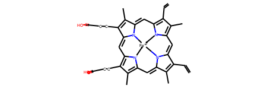

## Myoglobin

I cannot use `pyrosetta.toolbox.rcsb.pose_from_rcsb(pdbcode)` because that strips the cofactor.
When `load_PDB_components` is true pyrosetta raises 
an error because of the 'OH' residue.

So I decided to make my own params file for heme B.



First I downloaded the definition from PDBe.
```python
def save_ftp(url, filename):
    import shutil
    import urllib.request as request
    from contextlib import closing

    with closing(request.urlopen(url)) as r:
        with open(filename, 'wb') as f:
            shutil.copyfileobj(r, f)

            
ligand_resn = 'HEM'
save_ftp(url=f'ftp://ftp.ebi.ac.uk/pub/databases/msd/pdbechem/files/pdb/{ligand_resn}.pdb',
         filename=f'{ligand_resn}.pdb')
save_ftp(url=f'ftp://ftp.ebi.ac.uk/pub/databases/msd/pdbechem/files/sdf/{ligand_resn}.sdf',
         filename=f'{ligand_resn}.sdf')
```

Then I opened the files, but it turns out the sdf does not sanitise.
I need a pdb based mol for the atom names and a sdf for the bond order (reference).

```python
from rdkit import Chem
from rdkit.Chem import AllChem

pdb = Chem.MolFromPDBFile(f'{ligand_resn}.pdb', removeHs=False)
sdf = Chem.SDMolSupplier(f'{ligand_resn}.sdf', sanitize=False, removeHs=False)[0]

#pdb2 = AllChem.AssignBondOrdersFromTemplate(sdf, pdb)  # Sanitisation fails
```

Trying the SMILES approach for the reference turned out to be even crazier as the PDB SMILES
is broken. Likewise that from Wikipedia. Therefore I did some looking into this.

It is a formalism problem as dative bonds are involved in the resonance is peculiar.

A pyrrole ring by itself is `[nH]1cccc1`, but in haem none of the pyrroles are protonated, 
it would be `[n-]1cccc1` form.
The haem without a bound iron, a protoporphyrin IX ring has two nitrogens with a negative formal charge
—technically the charge is distributed.
The SMILES for that is `C=Cc1c(C)c2cc3[n-]c(cc4nc(cc5[n-]c(cc1n2)c(C)c5C=C)c(C)=c4CCC(=O)O)c(CCC(=O)O)c3C.[Fe2+]`.
The two fragments have no net charge —ignoring the carboxyls.
When an iron is added to the ring, the two negative nitrogens form a regular single bond (its two electrons form a bond)
annuling the charge on them and the iron.
while the other two nitrogens form a dative bond, so the nitrogen gains a negative charge, while the iron a positive one.
The SMILES is something like:
`C=Cc1c(C)c2[n-]3->[Fe+2]45<-[n-]6c(c(C)c(CCC(=O)O)c6C=c6c(CCC(=O)O)c(C)c(n64)=Cc13)C=c1c(C)c(C=C)c(n15)=C2`

Therefore a few things need to be done:

```python
sdf2 = Chem.RWMol(sdf)
sdf2.UpdatePropertyCache(strict=False)

iron = sdf2.GetAtomsMatchingQuery(Chem.rdqueries.AtomNumEqualsQueryAtom(26))[0]
nitrogens = list(sdf2.GetAtomsMatchingQuery(Chem.rdqueries.AtomNumEqualsQueryAtom(7)))

# remove bond for now
for bond in iron.GetBonds():
    sdf2.RemoveBond(bond.GetBeginAtomIdx(), bond.GetEndAtomIdx())

for nitro in (nitrogens[0], nitrogens[2]):
    nitro.SetNumExplicitHs(0)
    nitro.SetFormalCharge(-1)
for nitro in (nitrogens[1], nitrogens[3]):
    nitro.SetNumExplicitHs(0)
iron.SetFormalCharge(2)

Chem.SanitizeMol(sdf2)  # makes it aromatic!

for nitro in (nitrogens[0], nitrogens[2]):
    sdf2.AddBond(nitro.GetIdx(), iron.GetIdx(),Chem.BondType.DATIVE)
    
for nitro in (nitrogens[1], nitrogens[3]):
    sdf2.AddBond(nitro.GetIdx(), iron.GetIdx(),Chem.BondType.SINGLE)


Chem.SanitizeMol(sdf2)
# sdf2 = Chem.RemoveHs(sdf2) pdb has hydrogens.
```

So now that the molecule is decent, the bond order and charges can be applied to PDB.
And then the carboxylic acids deprotonated.

```python
pdb2 = AllChem.AssignBondOrdersFromTemplate(sdf2, pdb)  # ValueError: No matching found
pdb2 = Chem.RWMol(pdb2)
pdb2.UpdatePropertyCache(strict=False)
for carboxy in pdb2.GetSubstructMatches(Chem.MolFromSmiles('CC(=O)[OH]')):
    oxy = pdb2.GetAtomWithIdx(carboxy[-1])
    oxy.SetFormalCharge(-1)
    hydro = [n for n in oxy.GetNeighbors() if n.GetSymbol() == 'H'][0]
    pdb2.RemoveAtom(hydro.GetIdx())
Chem.SanitizeMol(pdb2)
Chem.MolToPDBFile(pdb2, 'HEM.pdb')
```

Using it to generate a params file:

```python
from rdkit_to_params import Params

params = Params.from_mol(mol=pdb2, name='HEM')
params.dump('haem.params')
pose = params.test()

scorefxn = pyrosetta.get_fa_scorefxn()
print(scorefxn(pose))

import nglview as nv
nv.show_rosetta(pose)
```

However, this is loads with the protein, but it lacks two connection as in the file there are LINK records.

So two dummy atoms need to be attached to the iron, because `rdkit_to_params.Params` will convert these.
This means adding two atoms to the Chem.RWMol object and doing a partial embed, which may or may not work
as it needs the molecule to be at a somewhat energy minimum (MMFF minimised) etc.
However, this is a lot of effort already, so I'll stick with ubiquitin.